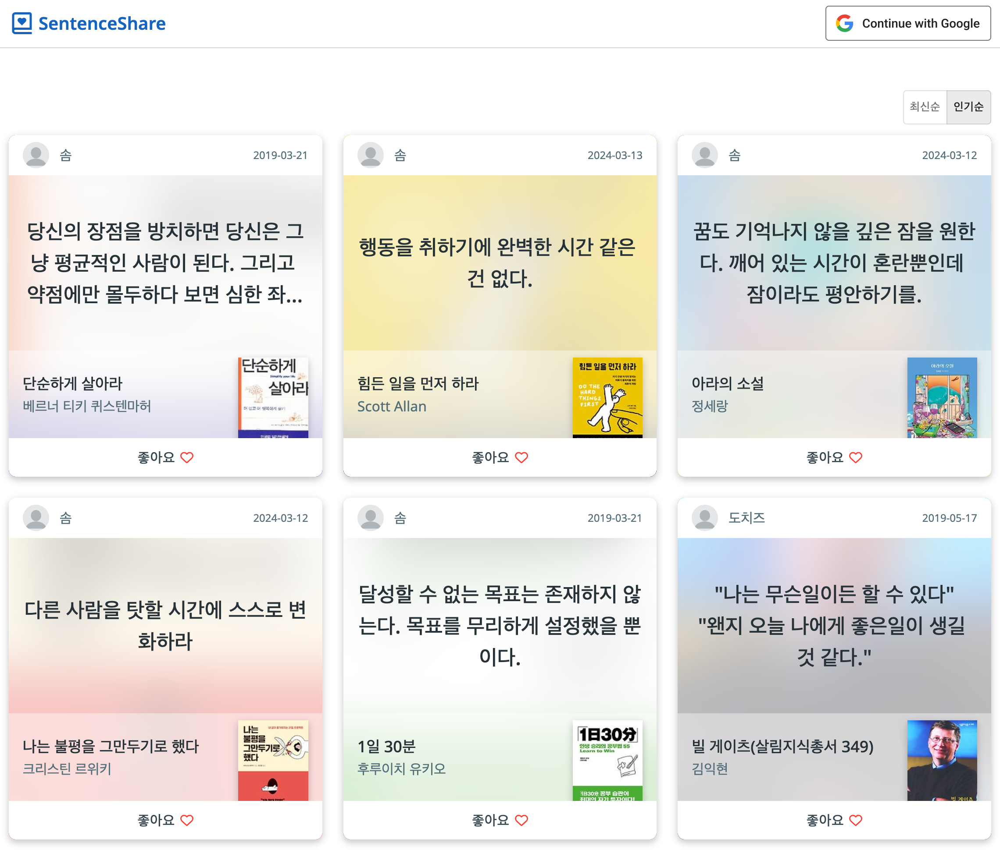
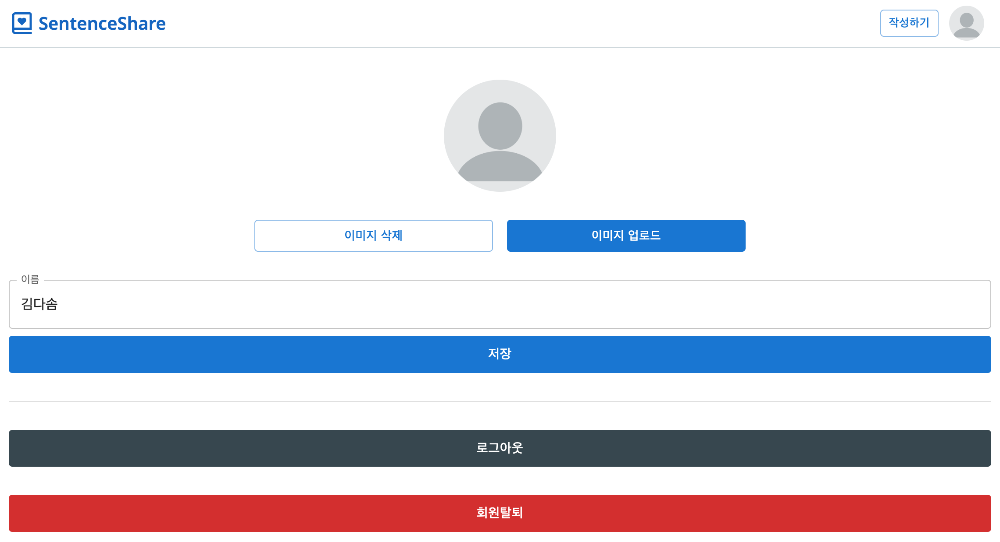
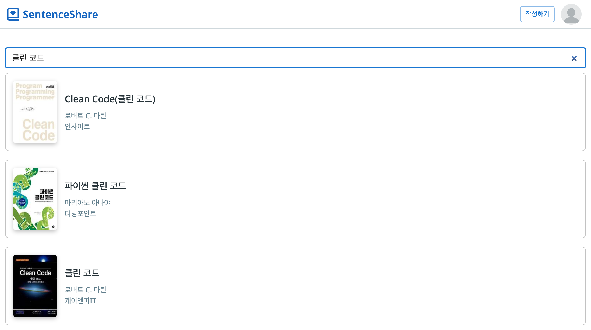
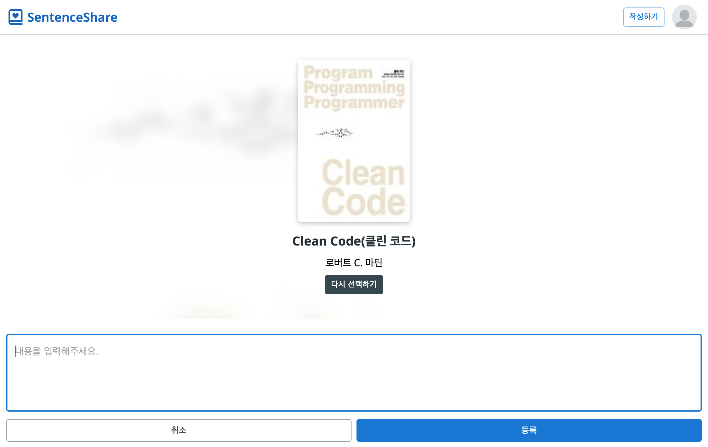
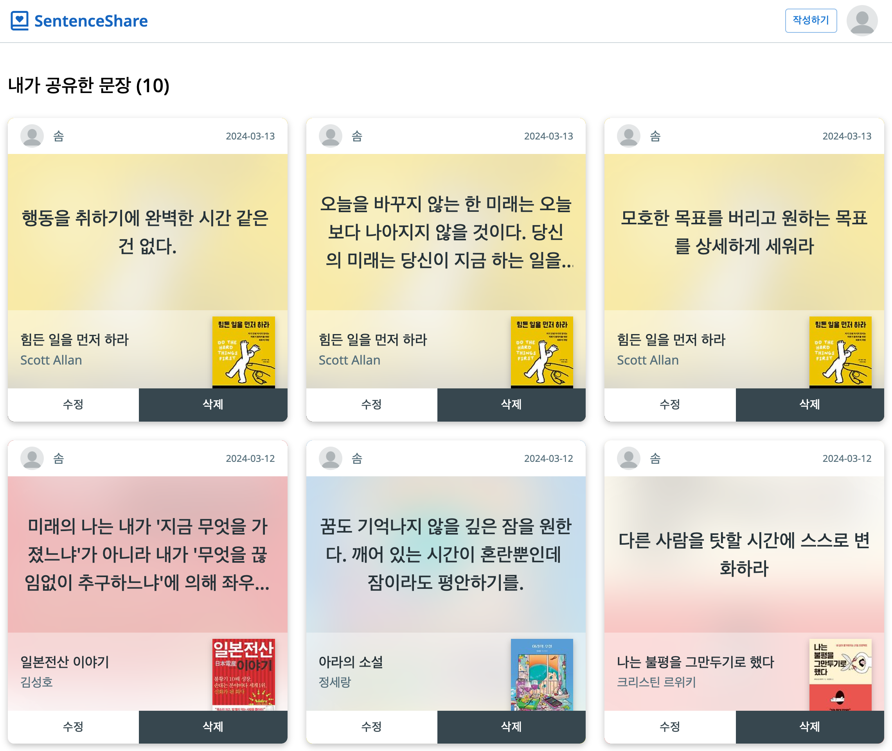
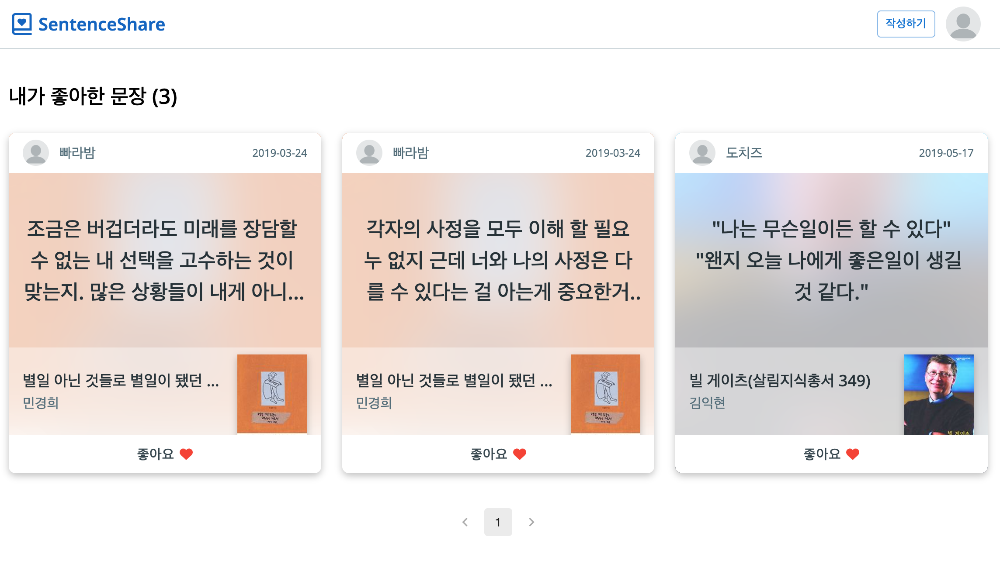
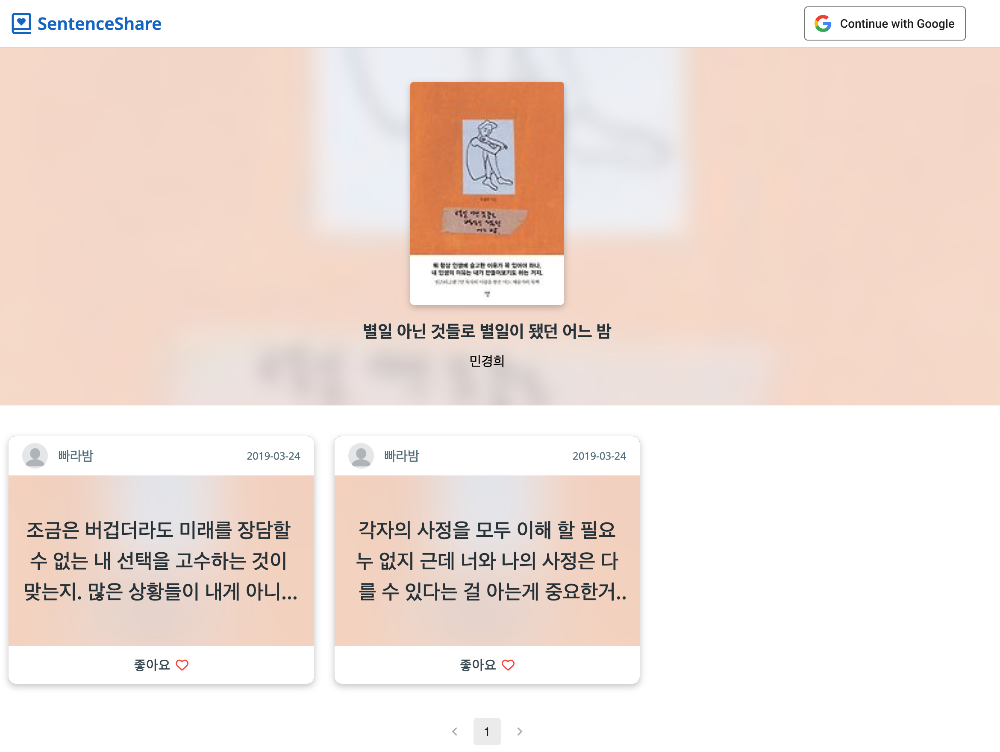

# Sentence Share

책을 읽다가 마음에 드는 문장을 발견하면 기록하는 서비스입니다.

## v2.0

### 배포 URL

https://sentence-share.vercel.app/

### 사용 기술

        

### 폴더 구조

```
src/
├── app/                      # Next.js App Router 기반 라우트
│ ├── [route]/                # 라우트 폴더 (예: sentence, my, setting 등)
│ │ ├── page.tsx              # 라우트 진입점
│ │ ├── components/           # 해당 라우트 전용 UI 컴포넌트
│ │ ├── hooks/                # 해당 라우트 전용 hook
│ │ └── api/                  # 해당 라우트 전용 API 호출 함수
├── components/               # 공용 컴포넌트 (Atomic Design 기반)
│ ├── atoms/
│ ├── molecules/
│ └── organisms/
├── api/                      # 전역 API 호출 함수
├── constants/                # 전역 상수
├── db/                       # 데이터베이스 설정, 모델, 컨트롤러
├── hooks/                    # 전역 공용 훅
├── lib/                      # 외부 SDK 초기화, config (ex. firebase)
├── mocks/                    # 테스트 및 Storybook용 mock 데이터
├── store/                    # 글로벌 상태 관리 (Zustand 관련 코드)
├── types/                    # 전역 타입 정의
└── utils/                    # 유틸리티 함수
```

### 주요 기능

- 구글 계정으로 회원가입
- 최신순/인기순 정렬

  

- 닉네임과 프로필 이미지 변경

  

- 문장 작성 및 수정

  

  

- 내가 등록한 문장, 좋아한 문장 목록

  

  

- 책에 등록된 문장 목록

  

### v1.0에서 달라진 점

- React를 버전을 업데이트했습니다.
- Vite를 사용하여 환경을 구성하였습니다.
- Typescript를 적용했습니다.
- Storybook로 컴포넌트를 관리합니다.
- Zustand로 클라이언트 상태를 관리합니다.
- github actions로 배포 자동화를 했습니다.
- 전체적인 UI를 개선했습니다.

---

## v1.0

### 링크

https://sentence-share.firebaseapp.com/

- 기간: 2019. 03. 10 ~ 03. 24

### 사용 기술

- HTML
- CSS(SCSS)
- React
  - create-react-app
  - react-router
  - redux
  - redux-thunk
- immutable.js
- axios
- firebase
- 카카오 검색 API
- 반응형 웹
